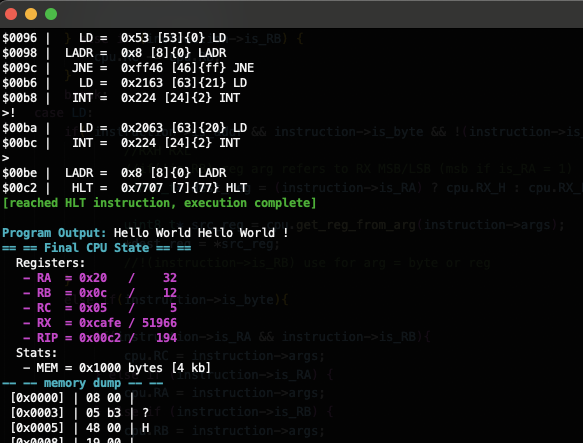

# SMISA: an 8-bit CPU architecture 

I made up a CPU and its corresponding instruction set without googling anything for fun last night.

sometimes doing is better than designing

[Instruction Set Architecture Overview](./ISA.md)

[Example Programs](./emu/asm/)

---

### Features
- From scratch basic 8-bit CPU ISA 
    - CPU Emulator
    - Assembler with labels, comments, etc. 
    - Fully functional! 

### TODO
- Add a stack (push/pop, bp/sp regs)
- Add some DMA areas or interupts for doing stuff
    - get enough going that making this in verilog is worth it (ex. add GPIO dma area to make bad microcontroller)
- addressing mode cleanups 
- assembler needs macros (cheat and use c preprocessor) and a rewrite for label bug fix
- fundamental flaws in this ISA because I made it in one sitting to see if I could without looking up how others have
    - good because if I did not do this I would still be researching and designing instead of just making it! 
    - bad because I enjoyed this and want to keep doing it, but it could use a from the ground up redo 
- relearn verilog for like the fourth time
    - cry because FPGA documentation

---

### see ./emu/asm/ASM.sma and ISA.md for more details!

ps. this acts as proof if society collapsed I could make a computer from scratch, which is a pretty entertaining notion 